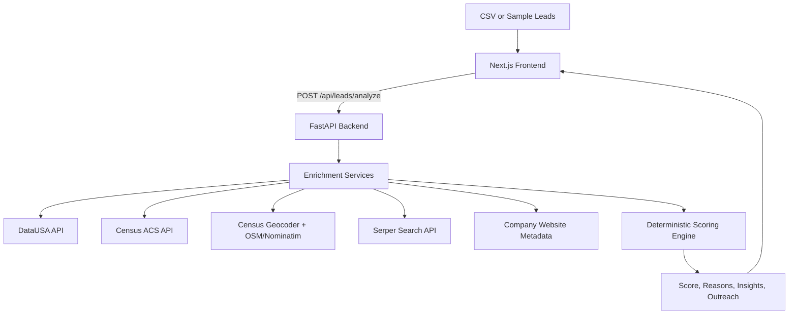

# Inbound SDR Copilot Lead Scoring System

## Overview

Inbound SDR Copilot is a lead enrichment and scoring tool designed for EliseAI's property management sales motion.

The system takes raw inbound lead data, enriches it with public data sources, scores each lead using an explainable deterministic rubric, and generates SDR-ready outputs such as sales insights, outreach copy, and follow-up suggestions.

This project is built for the GTM Engineer practical assignment: automate or augment the inbound lead process using public APIs, produce enriched and scored leads, generate useful sales outputs, and describe how the tool would be tested and rolled out in a sales organization.

## Objective

The goal is to help SDRs quickly answer four questions:

- Who should I prioritize?
- Why is this lead worth my time?
- What should I say?

The system estimates:

- how much leasing demand exists in the lead's market
- how strong the company fit is for EliseAI
- whether the submitted property appears residential and relevant

The scoring system is intentionally explainable, deterministic, and robust when public company data is incomplete.

## ICP Definition

A strong EliseAI property management lead is a property management or real estate operator managing residential, especially multifamily, properties in markets with high leasing demand and meaningful operational complexity.

Key ICP traits:

- residential or multifamily property management
- high leasing volume
- multiple units, communities, or properties
- tenant or resident-facing workflows
- leasing inquiries, tour scheduling, follow-ups, maintenance, or resident communication
- activity in rental-heavy or growing markets

The goal is not to perfectly calculate company size. The goal is to detect reliable public signals that suggest the company likely has enough leasing or resident communication volume to benefit from EliseAI.

## Core Assumptions

- A better lead is connected to property management, multifamily, real estate operations, leasing, or adjacent housing workflows.
- Markets with larger populations, stronger growth, higher rental intensity, and stronger economic indicators are more likely to support active leasing operations.
- Submitted property context should help distinguish residential rental opportunities from commercial or irrelevant properties.
- Public data is incomplete, especially for smaller property managers, so the system should act as a decision-support tool rather than a perfect qualification engine.
- City-level market data is a proxy for property opportunity, not proof of account quality.
- Missing company data should lower confidence, not automatically make a lead low priority.
- Deterministic scoring is preferred for trust. LLMs, if used, should generate summaries and outreach from already-computed facts rather than decide the score.

## Data Sources and APIs

The enrichment layer uses public data sources that each answer a specific sales question.

### DataUSA API

Used for:

- population
- median income
- historical city or metro trends

Why it matters:

DataUSA is simple to query and useful for market-level economic context. It helps estimate whether the lead is located in a large, growing, economically attractive market.

### U.S. Census API / ACS

Used for:

- population
- renter share
- housing units
- occupancy or vacancy indicators when available
- housing density proxies

Why it matters:

Census and ACS data are authoritative and provide stronger rental-market indicators than generic economic data alone.

### Census Geocoder or Nominatim

Used for:

- address normalization
- city/state validation
- optional latitude and longitude
- optional mapping to county, ZIP, or census geography
- OSM / Nominatim property metadata such as `class` and `type` when available

Why it matters:

Normalized geography makes downstream market enrichment more reliable. OSM property metadata also provides a useful first-pass property-type signal, especially for rejecting obvious non-residential assets such as offices, hospitals, campuses, warehouses, and retail properties.

### Serper Search API

Used for:

- company search snippets for account-level fit
- one property-focused search query for property-scale and leasing evidence
- source URLs and snippets that can be audited in score explanations

Why it matters:

Search results help fill gaps when company websites or OSM metadata are sparse. Property search evidence is filtered strictly: snippets are only used when they reference the submitted exact address, exact street, or submitted building name. Neighborhood-level pages, city-level apartment pages, nearby listings, and snippets for different buildings are discarded before classification.

### Company Website Metadata

Used for:

- company website title and meta description
- homepage keyword extraction
- business type classification
- evidence of property management, multifamily, residential, leasing, or resident workflows

Why it matters:

Company fit is the most important part of the score. When available, public website metadata can provide simple, explainable ICP signals without relying on paid enrichment vendors or brittle deep scraping.

### Optional Sources

Optional sources can improve the product but are not required for the MVP:

- Walk Score API for walkability, transit score, and density proxies
- Wikipedia API/News API for large companies with structured public descriptions
- future CRM data for conversion feedback and account history

## Scoring Framework

The scoring model follows this structure:

```text
ICP -> Market Fit -> Company Fit -> Property Fit -> Final Score -> Sales Outputs
```

Final score is out of 100 points:


| Category     | Points | Purpose                                                                  |
| ------------ | ------ | ------------------------------------------------------------------------ |
| Market Fit   | 45     | Estimate leasing demand at both city and neighborhood level              |
| Company Fit  | 39     | Estimate leasing volume, operational complexity, and EliseAI product fit |
| Property Fit | 16     | Estimate whether the submitted property appears residential and relevant |


The lead opportunity is scored as the combination of market demand, account fit, and submitted-property fit. Market Fit remains the largest single category, while Company Fit and Property Fit together carry the majority of the score because buyer relevance and property relevance determine whether EliseAI is likely useful.

## Market Fit: 45 Points

Market Fit estimates whether the property is located in a strong rental market and a locally attractive neighborhood. It intentionally combines macro city-level momentum with address-sensitive neighborhood signals.

### City / Market Attractiveness: 12 Points

Purpose: estimate broad market scale, rental market value, and light growth upside.

Sources:

- Data USA
- ACS 5-year place-level data

Signals:

- city/place population
- city/place median gross rent
- multi-year population growth

Reasoning:

The macro layer should capture whether the property sits in an economically valuable rental market, not just whether the city population is growing. Median gross rent is treated as a rental market value signal, while renter share remains the main leasing-volume signal. Growth is kept as a light upside signal so mature high-value markets are not unfairly penalized for flat or slightly declining population.

Scoring:

- population scale: 4 points
- median gross rent: 5 points
- growth momentum: 3 points

### Neighborhood Rental Demand: 10 Points

Purpose: estimate local rental-market relevance near the submitted property.

Sources:

- Census Geocoder
- ACS 5-year tract or block-group data

Signals:

- renter share
- local housing units as a stability signal, not as a direct scoring input

Reasoning:

This is the core address-sensitive market signal. A property in a renter-heavy tract or block group is more likely to sit in an area with leasing activity, resident turnover, and property operations complexity. To avoid block-group artifacts, renter share is blended with tract-level renter share and capped before scoring. If the block group has a very small housing base, tract-level values receive more influence.

### Neighborhood Economic Strength: 8 Points

Purpose: estimate whether the local neighborhood supports valuable rental operations.

Sources:

- ACS 5-year tract or block-group data

Signals:

- median household income

Reasoning:

Higher-income or economically strong neighborhoods may support higher-value rental operations and stronger willingness to pay for operational software. This should matter, but not dominate.

### Leasing Pressure: 6 Points

Purpose: estimate how tight the local rental market may be.

Sources:

- ACS 5-year tract or block-group data

Signals:

- vacancy rate

Reasoning:

Vacancy provides a rough indication of leasing pressure. It is scored in soft bands rather than linearly:

- below 5%: strong positive
- 5-15%: neutral or healthy
- 15-25%: mild tempering
- above 25%: moderate tempering

This avoids over-penalizing markets where vacancy may reflect new supply, churn, seasonality, student housing, or ACS small-area noise.

### Access / Urban Proxy: 9 Points

Purpose: approximate walkability, transit access, and urban density without relying on paid or brittle external APIs.

Sources:

- ACS 5-year tract or block-group data

Signals:

- no-vehicle household share
- public transit commute share
- walking commute share

Reasoning:

Walkability and urban access are relevant to rental demand. ACS commute and vehicle-access variables provide free, explainable proxies for urban rental-market characteristics without relying on paid walkability APIs.

### Edge-Case Guards

Market Fit includes a few lightweight guards to keep ACS small-area data from distorting otherwise strong markets:

- If neighborhood income is extremely low in a dense urban tract, income is treated as neutral instead of a hard negative.
- If renter share is low and vacancy is high, a small dampener is applied because the tract may be more commercial or mixed-use than residential.
- High vacancy is softened because it can reflect supply, churn, or lease-up rather than weak demand.

### Market Output

The system should return:

- Market Fit score out of 45
- market summary
- key reasons
- raw metrics used

Example reasons:

- City population, median gross rent, and growth indicate market attractiveness.
- Tract-level renter share indicates strong local rental demand.
- Transit and no-vehicle household signals suggest urban access.

## Company / Property Fit: 55 Points

Company / Property Fit estimates whether the company and submitted property appear relevant to EliseAI's property management ICP.

This analysis detects evidence of leasing volume, operational complexity, product fit, and property relevance. It should not claim to know exact portfolio or property size unless that data is directly found.

Live company scoring uses a bounded extraction and classification pipeline:

```text
Serper + company website evidence -> OpenAI structured classification -> deterministic scale calibration and score mapping -> audit output
```

OpenAI is used only to interpret source-backed evidence into micro-signal buckets and cited evidence. It does not browse, research independently, or return final scores. Numeric scale is calibrated by code, not by the LLM: the scorer extracts all candidate counts for units, homes, apartments, communities, and properties, filters obvious transaction/listing/subset noise, and uses the largest valid portfolio-scale candidate. If OpenAI is unavailable, returns invalid JSON, omits required fields, cites unsupported evidence, or returns unsupported buckets, the system falls back to the deterministic rule classifier.

### Company Fit: 39 Points

Purpose: determine whether EliseAI is likely useful for the account.

Positive signals:

- property management
- multifamily
- apartments
- residential
- leasing
- communities
- rental housing
- portfolio
- properties
- units
- multiple locations
- leasing services
- tenant services
- resident communication
- maintenance requests
- tour scheduling
- property operations
- renewals
- rent collection
- multi-unit management

Suggested scoring:

- strong leasing-volume, operational-complexity, and product-fit evidence: 32-39
- relevant property operator with some operating scale or workflow signals: 22-31
- partial or unclear fit: 9-21
- clearly unrelated: 0-8

Micro-signal scoring remains deterministic:

- leasing volume: Very High 13, High 11, Medium 8, Low 4, None 0, Unknown 0
- operational complexity: Very High 13, High 9, Medium 6, Low 4, None 0, Unknown 0
- product fit: Very Strong 13, Strong 10, Moderate 5, Weak 1, None 0, Unknown 0

`Unknown` means insufficient evidence and contributes no points. Confidence is audit metadata only and does not change the numeric score. If product fit is Weak, Company Fit is capped at 15 to prevent false positives. If product fit is None, Company Fit is capped at 5 for non-ICP rejection.

Company Fit also applies a small deterministic calibration layer:

- Very High leasing volume implies Very High operational complexity.
- High leasing volume implies at least High operational complexity.
- Low leasing volume caps operational complexity at Low.
- single-family rental operators cap leasing volume and product fit below multifamily levels.
- scaled multifamily operators receive product-fit calibration from extracted unit count.

Hard constraint:

If the company/property context is clearly unrelated to real estate, property management, multifamily, apartments, residential leasing, or housing operations, cap the final score at Medium priority regardless of market score.

### Property Fit: 16 Points

Purpose: decide whether the submitted property is a residential leasing asset where EliseAI can plausibly create value.

Positive signals:

- OSM / Nominatim metadata identifies the property as apartments, residential, student housing, senior living, or another residential type
- address-matched search results mention unit count, apartment homes, bedrooms, communities, or similar scale evidence
- address-matched search results mention active rental demand signals such as now leasing, available units, floor plans, schedule a tour, or a leasing office

Extraction:

- fetch OSM / Nominatim metadata for the submitted address and map meaningful `class` / `type` values into property categories
- run one Serper query for the submitted property address, city, and state
- discard property search snippets unless they reference the exact submitted address, exact street, or submitted building name
- reject neighborhood-level pages, city-level apartment searches, nearby listings, and snippets for different buildings
- pass the remaining property-level snippets to OpenAI for structured classification
- classify exactly three signals: `property_type`, `property_scale`, and `leasing_activity`
- apply deterministic scoring rules in code; the LLM does not calculate points

Scoring:

- Property Type, 0-6 points: multifamily, student housing, or senior living = 6; residential or single-family rental = 4; mixed-use = 3; commercial or non-residential = 0; unknown = 3.
- Property Scale, 0-6 points: 200+ units/homes/beds/properties = 6; 50-199 = 5; 1-49 or single-property evidence = 3; none = 0; unknown = 3.
- Leasing Activity, 0-4 points: active leasing/availability/tour evidence = 4; moderate rental/floor-plan evidence = 3; no leasing evidence = 0; unknown = 2.

Important:

Property relevance belongs in Company / Property Fit, not Market Fit. Property type is treated as a gate: if reliable OSM or validated search evidence indicates a non-residential asset, Property Fit is capped so commercial offices, campuses, hospitals, warehouses, and similar assets cannot score highly from generic leasing or search noise. The goal is consistency and explainability, not perfect property reconstruction. When data is unclear, stable neutral fallbacks keep scores from swinging on sparse search results.

### Company Output

The system should return:

- Company / Property Fit score out of 55, exposed as separate Company Fit and Property Fit sections
- separate Company Fit and Property Fit sections for UI/demo explainability
- company fit label: Strong fit, Likely fit, Unclear fit, or Poor fit
- evidence snippets from website metadata and search snippets
- score breakdown for leasing volume, operational complexity, and product fit
- extraction audit with raw evidence, evidence source, parsed value, interpreted bucket, confidence, classifier, and score contribution
- property-fit breakdown for property type, property scale, and leasing activity
- key reasons

Example reasons:

- Company description indicates multifamily property management.
- Website references multiple apartment communities.
- Public materials mention resident services and leasing operations.

## Final Score and Priority Tiers

```text
Final Score = Market Fit + Company Fit + Property Fit
```


| Final Score | Priority        |
| ----------- | --------------- |
| 75-100      | High Priority   |
| 50-75       | Medium Priority |
| 0-29        | Low Priority    |


## Scoring Guardrails

- Strong leads should score well from market, company, and property fit alone.
- Missing company data should not automatically make a lead low priority.
- Clearly irrelevant companies should be capped at low or medium priority.
- Every score must include human-readable reasoning.
- Every output should distinguish between directly sourced facts and inferred signals when possible.
- Address resolution confidence should not reduce the numeric Market Fit score. It should be shown as metadata so users understand how the tract/block-group geography was resolved.

## Address Resolution Confidence

Market Fit V2 uses the submitted property address to resolve tract/block-group geography. Because real inbound addresses can include branded building names, neighborhood names, odd local address formats, or campus/federal land, address resolution is tracked separately from scoring.

Resolution order:

1. Census exact address match.
2. Coordinate fallback using Nominatim, followed by Census coordinate-to-geography lookup.
3. Census normalized variant match.
4. Unresolved, with a request for the user to confirm the address.

Confidence levels:


| Confidence | Meaning                                                                                                                   | Product behavior                                                              |
| ---------- | ------------------------------------------------------------------------------------------------------------------------- | ----------------------------------------------------------------------------- |
| High       | Census matched the submitted address directly.                                                                            | Use tract/block group without warning.                                        |
| Medium     | Direct Census match failed, but coordinate fallback found a plausible location and Census mapped it to tract/block group. | Use score as-is and show an informational note.                               |
| Low        | Only a normalized variant matched, or the matched address may differ materially from the input.                           | Use score as-is and show a stronger review note.                              |
| Unresolved | No reliable tract/block-group geography was found.                                                                        | Use city-level fallback if available and ask the user to confirm the address. |


The Market Fit score remains based on the resolved geography. Confidence does not penalize the score; it explains the assumption used to get the neighborhood data.

Example explanation for medium confidence:

```text
We could not find a direct Census match for the submitted address, so we used coordinate-based resolution. The fallback returned a location that appears to match the submitted address or property area, and Census mapped that coordinate to a tract/block group. The Market Fit score is based on that resolved geography.
```

## Expected System Behavior

### Case 1: Strong Market + Sparse Company Data

Expected result: Medium priority or review-worthy.

Reason: strong market signals should make the lead worth review, but the lead should not become high priority without evidence of ICP fit.

### Case 2: Weak Market + Strong Property Management Company

Expected result: Medium priority.

Reason: strong company fit matters, but lower market demand limits urgency.

### Case 3: Strong Market + Irrelevant Company

Expected result: Low priority or capped at medium-low.

Reason: macro demand does not matter if the company is not a relevant buyer.

### Case 4: Strong Market + Strong Property Management Company + Clear Residential Property

Expected result: High priority.

Reason: strong market, company, and property fit indicate a high-quality lead.

## Output Requirements

For each lead, the system should output:

### Final Score

- numeric score out of 100
- priority tier

### Score Breakdown

- Market Fit score out of 45
- Company Fit score out of 39
- Property Fit score out of 16

### Why This Lead

Explain market and company fit.

Example:

- This lead operates in a high-growth rental market.
- The company appears to manage residential properties.
- Public materials indicate tenant-facing leasing operations.

### Sales Insights

Short bullets an SDR can use before outreach.

### Outreach Email

Use:

- contact name
- company name
- market insight
- company fit insight
- property fit insight

The LLM, if used, should only generate outreach from verified enrichment and score reasoning. It should not invent company facts.

### Follow-Up Suggestions

Suggested MVP cadence:

- Day 0: initial email
- Day 2: follow-up 1
- Day 5: follow-up 2

## System Architecture

Initial implementation:

- Backend: FastAPI
- Frontend: Next.js 16 with React 19, Tailwind CSS 4, and shadcn/ui using the Nova preset
- Frontend package manager: pnpm
- Backend package manager/runtime workflow: uv
- Automation: trigger-based analysis through upload or button click
- Scoring: deterministic Python scoring engine
- Outreach: template-based or LLM-assisted generation from structured facts




## Sales Rollout Plan

### Phase 1: MVP Validation (Week 1)

Goal: prove the system works.

Activities:

- test with about 20-50 sample leads
- compare model scores against SDR intuition
- validate scoring accuracy, usefulness of insights, and quality of outreach emails

Stakeholders:

- 2-3 SDRs
- 1 Sales Manager

### Phase 2: Pilot (Week 2-3)

Goal: integrate into the real workflow.

Activities:

- run the tool on real inbound leads as a daily batch
- have SDRs review scores before outreach
- use generated emails as a starting point

Track:

- time saved per lead
- conversion rate versus baseline
- SDR feedback

### Phase 3: Iteration (Week 3-4)

Goal: improve signal quality.

Activities:

- refine scoring weights, property classification, and outreach tone
- review SDR feedback, edge cases, and mis-ranked leads

### Phase 4: Org Rollout (Week 4+)

Goal: full adoption.

Activities:

- integrate into the CRM workflow
- auto-trigger enrichment on new inbound leads
- add a feedback loop through the feature request and bug report buttons

## Limitations

- Free public APIs may have rate limits and incomplete coverage.
- City-level data is an imperfect proxy for property-level opportunity.
- Company website metadata may be missing, generic, or hard to classify.
- Search engines can return neighborhood, nearby, or different-building results, so property evidence is filtered by strict address/building identity before scoring.
- U.S. market data sources may not support international leads well.

