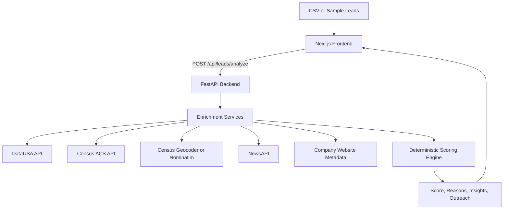

# Inbound SDR Copilot Lead Scoring System

## Overview

Inbound SDR Copilot is a lead enrichment and scoring tool designed for EliseAI's property management sales motion.

The system takes raw inbound lead data, enriches it with public data sources, scores each lead using an explainable deterministic rubric, and generates SDR-ready outputs such as sales insights, outreach copy, and follow-up suggestions.

This project is built for the GTM Engineer practical assignment: automate or augment the inbound lead process using public APIs, produce enriched and scored leads, generate useful sales outputs, and describe how the tool would be tested and rolled out in a sales organization.

## Objective

The goal is to help SDRs quickly answer four questions:

- Who should I prioritize?
- Why is this lead worth my time?
- Why should I reach out now?
- What should I say?

The system estimates:

- how much leasing demand exists in the lead's market
- how strong the company fit is for EliseAI
- whether there is a reason to prioritize outreach now

The scoring system is intentionally explainable, deterministic, and robust when public company data is incomplete.

## Assignment Alignment

The assessment asks for a working tool that:

- takes lead inputs
- enriches leads by calling at least two public APIs
- generates useful outputs for sales reps, including lead scoring, outreach email, and sales insights
- automates the process through either a schedule or a trigger
- includes a project plan for testing and rollout in the sales organization

This MVP satisfies those requirements through:

- CSV upload, sample data, or manual lead intake
- public API enrichment from demographic, housing, local, and news sources
- deterministic scoring across market fit, company fit, and timing
- ranked lead queue and lead detail views
- trigger-based analysis via a `Run Analysis` button
- a rollout plan for SDR testing, pilot, and production expansion

## ICP Definition

A strong EliseAI property management lead is a property management or real estate operator managing residential, especially multifamily, properties in markets with high leasing demand and meaningful operational complexity.

Key ICP traits:

- residential or multifamily property management
- high leasing volume
- multiple units, communities, or properties
- tenant or resident-facing workflows
- leasing inquiries, tour scheduling, follow-ups, maintenance, or resident communication
- activity in rental-heavy or growing markets

The goal is not to perfectly calculate company size. The goal is to detect reliable public signals that suggest the company likely has enough leasing or resident communication volume to benefit from EliseAI.

## Input Data

Each lead should include:

```json
{
  "name": "string",
  "email": "string",
  "company": "string",
  "address": "string",
  "city": "string",
  "state": "string",
  "country": "string"
}
```

Contact name and email are primarily used for outreach generation. Scoring is based primarily on:

- property location
- company fit
- public activity and timing signals

The MVP is optimized for U.S. leads because the selected demographic and housing APIs are U.S.-centric. Non-U.S. leads can still be accepted, but they should be flagged as having limited enrichment coverage.

## Core Assumptions

- A better lead is connected to property management, multifamily, real estate operations, leasing, or adjacent housing workflows.
- Markets with larger populations, stronger growth, higher rental intensity, and stronger economic indicators are more likely to support active leasing operations.
- Recent company or market activity can indicate urgency, but timing should only boost priority; it should not make a poor-fit lead look like a strong lead.
- Public data is incomplete, especially for smaller property managers, so the system should act as a decision-support tool rather than a perfect qualification engine.
- City-level market data is a proxy for property opportunity, not proof of account quality.
- Missing company data should lower confidence, not automatically make a lead low priority.
- Deterministic scoring is preferred for trust. LLMs, if used, should generate summaries and outreach from already-computed facts rather than decide the score.

## Data Sources and APIs

The enrichment layer uses public data sources that each answer a specific sales question.

### DataUSA API

Used for:

- population
- median income
- historical city or metro trends

Why it matters:

DataUSA is simple to query and useful for market-level economic context. It helps estimate whether the lead is located in a large, growing, economically attractive market.

### U.S. Census API / ACS

Used for:

- population
- renter share
- housing units
- occupancy or vacancy indicators when available
- housing density proxies

Why it matters:

Census and ACS data are authoritative and provide stronger rental-market indicators than generic economic data alone.

### Census Geocoder or Nominatim

Used for:

- address normalization
- city/state validation
- optional latitude and longitude
- optional mapping to county, ZIP, or census geography

Why it matters:

Normalized geography makes downstream market enrichment more reliable.

### NewsAPI

Used for:

- company mentions
- expansion announcements
- development activity
- acquisitions
- hiring or growth signals
- recent operational activity

Why it matters:

News data helps identify timing signals and gives SDRs a timely reason to personalize outreach.

### Company Website Metadata

Used for:

- company website title and meta description
- homepage keyword extraction
- business type classification
- evidence of property management, multifamily, residential, leasing, or resident workflows

Why it matters:

Company fit is the most important part of the score. When available, public website metadata can provide simple, explainable ICP signals without relying on paid enrichment vendors or brittle deep scraping.

### Optional Sources

Optional sources can improve the product but are not required for the MVP:

- Walk Score API for walkability, transit score, and density proxies
- Wikipedia API for large companies with structured public descriptions
- future CRM data for conversion feedback and account history

## Scoring Framework

The scoring model follows this structure:

```text
ICP -> Market Fit -> Company Fit -> Timing -> Final Score -> Sales Outputs
```

Final score is out of 100 points:


| Category               | Points | Purpose                                                                 |
| ---------------------- | ------ | ----------------------------------------------------------------------- |
| Market Fit             | 45     | Estimate leasing demand at both city and neighborhood level             |
| Company Fit            | 39     | Estimate leasing volume, operational complexity, and EliseAI product fit |
| Property Fit           | 6      | Estimate whether the submitted property appears residential and relevant |
| Timing / Why Now       | 10     | Estimate whether there is a current reason to prioritize outreach       |


Market Fit and Company / Property Fit carry equal weight because the lead opportunity is the combination of the property location and the buyer fit. Property Fit is exposed separately for explainability, but it remains part of the broader 45-point company/property bucket. Timing carries the least weight because urgency should boost a good lead, not rescue a bad one.

## Market Fit: 45 Points

Market Fit estimates whether the property is located in a strong rental market and a locally attractive neighborhood. It intentionally combines macro city-level momentum with address-sensitive neighborhood signals.

### City / Market Attractiveness: 12 Points

Purpose: estimate broad market scale, rental market value, and light growth upside.

Sources:

- Data USA
- ACS 5-year place-level data

Signals:

- city/place population
- city/place median gross rent
- multi-year population growth

Reasoning:

The macro layer should capture whether the property sits in an economically valuable rental market, not just whether the city population is growing. Median gross rent is treated as a rental market value signal, while renter share remains the main leasing-volume signal. Growth is kept as a light upside signal so mature high-value markets are not unfairly penalized for flat or slightly declining population.

Scoring:

- population scale: 4 points
- median gross rent: 5 points
- growth momentum: 3 points

### Neighborhood Rental Demand: 10 Points

Purpose: estimate local rental-market relevance near the submitted property.

Sources:

- Census Geocoder
- ACS 5-year tract or block-group data

Signals:

- renter share
- local housing units as a stability signal, not as a direct scoring input

Reasoning:

This is the core address-sensitive market signal. A property in a renter-heavy tract or block group is more likely to sit in an area with leasing activity, resident turnover, and property operations complexity. To avoid block-group artifacts, renter share is blended with tract-level renter share and capped before scoring. If the block group has a very small housing base, tract-level values receive more influence.

### Neighborhood Economic Strength: 8 Points

Purpose: estimate whether the local neighborhood supports valuable rental operations.

Sources:

- ACS 5-year tract or block-group data

Signals:

- median household income

Reasoning:

Higher-income or economically strong neighborhoods may support higher-value rental operations and stronger willingness to pay for operational software. This should matter, but not dominate.

### Leasing Pressure: 6 Points

Purpose: estimate how tight the local rental market may be.

Sources:

- ACS 5-year tract or block-group data

Signals:

- vacancy rate

Reasoning:

Vacancy provides a rough indication of leasing pressure. It is scored in soft bands rather than linearly:

- below 5%: strong positive
- 5-15%: neutral or healthy
- 15-25%: mild tempering
- above 25%: moderate tempering

This avoids over-penalizing markets where vacancy may reflect new supply, churn, seasonality, student housing, or ACS small-area noise.

### Access / Urban Proxy: 9 Points

Purpose: approximate walkability, transit access, and urban density without relying on paid or brittle external APIs.

Sources:

- ACS 5-year tract or block-group data

Signals:

- no-vehicle household share
- public transit commute share
- walking commute share

Reasoning:

Walkability and urban access are relevant to rental demand, but Walk Score and OSM-style integrations add access and reliability risk. ACS commute and vehicle-access variables provide free, explainable proxies for urban rental-market characteristics.

### Edge-Case Guards

Market Fit includes a few lightweight guards to keep ACS small-area data from distorting otherwise strong markets:

- If neighborhood income is extremely low in a dense urban tract, income is treated as neutral instead of a hard negative.
- If renter share is low and vacancy is high, a small dampener is applied because the tract may be more commercial or mixed-use than residential.
- High vacancy is softened because it can reflect supply, churn, or lease-up rather than weak demand.

### Market Output

The system should return:

- Market Fit score out of 45
- market summary
- key reasons
- raw metrics used

Example reasons:

- City population, median gross rent, and growth indicate market attractiveness.
- Tract-level renter share indicates strong local rental demand.
- Transit and no-vehicle household signals suggest urban access.

## Company / Property Fit: 45 Points

Company / Property Fit estimates whether the company and submitted property appear relevant to EliseAI's property management ICP.

This analysis detects evidence of leasing volume, operational complexity, product fit, and basic residential property relevance. It should not claim to know exact portfolio size unless that data is directly found.

Live company scoring uses a bounded extraction and classification pipeline:

```text
Serper + company website evidence -> OpenAI structured classification -> deterministic scale calibration and score mapping -> audit output
```

OpenAI is used only to interpret source-backed evidence into micro-signal buckets and cited evidence. It does not browse, research independently, or return final scores. Numeric scale is calibrated by code, not by the LLM: the scorer extracts all candidate counts for units, homes, apartments, communities, and properties, filters obvious transaction/listing/subset noise, and uses the largest valid portfolio-scale candidate. If OpenAI is unavailable, returns invalid JSON, omits required fields, cites unsupported evidence, or returns unsupported buckets, the system falls back to the deterministic rule classifier.

### Company Fit: 39 Points

Purpose: determine whether EliseAI is likely useful for the account.

Positive signals:

- property management
- multifamily
- apartments
- residential
- leasing
- communities
- rental housing
- portfolio
- properties
- units
- multiple locations
- leasing services
- tenant services
- resident communication
- maintenance requests
- tour scheduling
- property operations
- renewals
- rent collection
- multi-unit management

Suggested scoring:

- strong leasing-volume, operational-complexity, and product-fit evidence: 32-39
- relevant property operator with some operating scale or workflow signals: 22-31
- partial or unclear fit: 9-21
- clearly unrelated: 0-8

Micro-signal scoring remains deterministic:

- leasing volume: Very High 13, High 11, Medium 8, Low 4, None 0, Unknown 0
- operational complexity: Very High 13, High 9, Medium 6, Low 4, None 0, Unknown 0
- product fit: Very Strong 13, Strong 10, Moderate 5, Weak 1, None 0, Unknown 0

`Unknown` means insufficient evidence and contributes no points. Confidence is audit metadata only and does not change the numeric score. If product fit is Weak, Company Fit is capped at 15 to prevent false positives. If product fit is None, Company Fit is capped at 5 for non-ICP rejection.

Company Fit also applies a small deterministic calibration layer:

- Very High leasing volume implies Very High operational complexity.
- High leasing volume implies at least High operational complexity.
- Low leasing volume caps operational complexity at Low.
- single-family rental operators cap leasing volume and product fit below multifamily levels.
- scaled multifamily operators receive product-fit calibration from extracted unit count.

Hard constraint:

If the company/property context is clearly unrelated to real estate, property management, multifamily, apartments, residential leasing, or housing operations, cap the final score at Medium priority regardless of market score.

### Timing Activity Signals

Recent activity is not part of Company Fit. It belongs in Timing and in SDR-facing explanations.

Positive signals:

- recent news
- recent development or project
- acquisition
- expansion
- hiring
- new community or property
- website has current operational information

Avoid rewarding generic or low-confidence mentions.

### Property Fit: 6 Points

Purpose: use the submitted property address as a lightweight signal for whether this is a relevant property/operator combination.

Positive signals:

- address or property name contains residential terms such as apartments, residences, homes, lofts, villas, flats, townhomes, or communities
- geocoder or later property context indicates likely residential or mixed-use context
- company text references the submitted property, communities, apartments, or resident workflows

Suggested scoring:

- clear residential or multifamily signal: 5-6
- likely residential or mixed-use: 3-4
- unknown or insufficient confidence: 3
- clearly commercial or irrelevant: 0-1

Important:

Property relevance belongs in Company / Property Fit, not Market Fit. Keep it simple: residential rental terms are positive, office/industrial/warehouse-style terms are weak or negative, and missing data defaults neutral rather than heavily penalizing the lead.

### Company Output

The system should return:

- Company / Property Fit score out of 45
- separate Company Fit and Property Fit sections for UI/demo explainability
- company fit label: Strong fit, Likely fit, Unclear fit, or Poor fit
- evidence snippets from website metadata and search snippets
- score breakdown for leasing volume, operational complexity, and product fit
- extraction audit with raw evidence, evidence source, parsed value, interpreted bucket, confidence, classifier, and score contribution
- key reasons

Example reasons:

- Company description indicates multifamily property management.
- Website references multiple apartment communities.
- Public materials mention resident services and leasing operations.

## Timing / Why Now: 10 Points

Timing estimates whether there is a current reason for an SDR to prioritize outreach immediately.

Timing should boost urgency, not determine baseline lead quality.

### Strong Timing Signal: 8-10 Points

Examples:

- expansion
- acquisition
- new development
- new property or community launch
- hiring or growth push
- funding or strategic partnership

### Moderate Timing Signal: 4-7 Points

Examples:

- recent article mention
- general business activity
- relevant market activity near the company or property location

### Weak or No Timing Signal: 0-3 Points

Examples:

- no recent relevant news
- old articles only
- irrelevant mentions

### Timing Output

The system should return:

- Timing score out of 10
- Why Now summary when applicable
- source headline or snippet when available

Example:

Recent expansion activity gives the SDR a timely reason to reach out.

## Final Score and Priority Tiers

```text
Final Score = Market Fit + Company Fit + Property Fit + Timing
```


| Final Score | Priority        |
| ----------- | --------------- |
| 40-100      | High Priority   |
| 30-39       | Medium Priority |
| 0-29        | Low Priority    |


## Scoring Guardrails

- Timing should never carry a bad lead into high priority by itself.
- Strong leads should still score well without timing signals.
- Missing company data should not automatically make a lead low priority.
- Clearly irrelevant companies should be capped at low or medium priority.
- Every score must include human-readable reasoning.
- Every output should distinguish between directly sourced facts and inferred signals when possible.
- Address resolution confidence should not reduce the numeric Market Fit score. It should be shown as metadata so users understand how the tract/block-group geography was resolved.

## Address Resolution Confidence

Market Fit V2 uses the submitted property address to resolve tract/block-group geography. Because real inbound addresses can include branded building names, neighborhood names, odd local address formats, or campus/federal land, address resolution is tracked separately from scoring.

Resolution order:

1. Census exact address match.
2. Coordinate fallback using Nominatim, followed by Census coordinate-to-geography lookup.
3. Census normalized variant match.
4. Unresolved, with a request for the user to confirm the address.

Confidence levels:


| Confidence | Meaning                                                                                                                   | Product behavior                                                              |
| ---------- | ------------------------------------------------------------------------------------------------------------------------- | ----------------------------------------------------------------------------- |
| High       | Census matched the submitted address directly.                                                                            | Use tract/block group without warning.                                        |
| Medium     | Direct Census match failed, but coordinate fallback found a plausible location and Census mapped it to tract/block group. | Use score as-is and show an informational note.                               |
| Low        | Only a normalized variant matched, or the matched address may differ materially from the input.                           | Use score as-is and show a stronger review note.                              |
| Unresolved | No reliable tract/block-group geography was found.                                                                        | Use city-level fallback if available and ask the user to confirm the address. |


The Market Fit score remains based on the resolved geography. Confidence does not penalize the score; it explains the assumption used to get the neighborhood data.

Example explanation for medium confidence:

```text
We could not find a direct Census match for the submitted address, so we used coordinate-based resolution. The fallback returned a location that appears to match the submitted address or property area, and Census mapped that coordinate to a tract/block group. The Market Fit score is based on that resolved geography.
```

## Expected System Behavior

### Case 1: Strong Market + Sparse Company Data

Expected result: Medium priority or review-worthy.

Reason: strong market signals should make the lead worth review, but the lead should not become high priority without evidence of ICP fit.

### Case 2: Weak Market + Strong Property Management Company

Expected result: Medium priority.

Reason: strong company fit matters, but lower market demand limits urgency.

### Case 3: Strong Market + Irrelevant Company

Expected result: Low priority or capped at medium-low.

Reason: macro demand does not matter if the company is not a relevant buyer.

### Case 4: Strong Market + Strong Property Management Company + Expansion News

Expected result: High priority.

Reason: strong baseline fit plus timing urgency.

## Output Requirements

For each lead, the system should output:

### Final Score

- numeric score out of 100
- priority tier

### Score Breakdown

- Market Fit score out of 45
- Company Fit score out of 39
- Property Fit score out of 6
- Timing score out of 10

### Why This Lead

Explain market and company fit.

Example:

- This lead operates in a high-growth rental market.
- The company appears to manage residential properties.
- Public materials indicate tenant-facing leasing operations.

### Why Now

Only include when timing signals exist.

Example:

- Recent expansion news gives the SDR a timely reason to reach out.

### Sales Insights

Short bullets an SDR can use before outreach.

### Outreach Email

Use:

- contact name
- company name
- market insight
- company fit insight
- timing signal if available

The LLM, if used, should only generate outreach from verified enrichment and score reasoning. It should not invent company facts.

### Follow-Up Suggestions

Suggested MVP cadence:

- Day 0: initial email
- Day 2: follow-up 1
- Day 5: follow-up 2

## System Architecture

Initial implementation:

- Backend: FastAPI
- Frontend: Next.js 16 with React 19, Tailwind CSS 4, and shadcn/ui using the Nova preset
- Frontend package manager: pnpm
- Backend package manager/runtime workflow: uv
- Automation: trigger-based analysis through upload or button click
- Scoring: deterministic Python scoring engine
- Outreach: template-based or LLM-assisted generation from structured facts




## Local Development

### Backend

```bash
cd backend
cp .env.example .env
uv sync
uv run dev
```

The FastAPI server runs on `http://localhost:8000`.

Useful endpoints:

- `GET /health`
- `POST /api/leads/analyze`

Market Fit V2 can be verified without starting the server:

```bash
cd backend
uv run python scripts/verify_market_fit.py
```

The verifier defaults to `301 W 2nd St, Austin, TX` and should return populated market metrics from Data USA and address-level Census Geocoder plus ACS 5-year enrichment, including city population, growth, city median gross rent, tract/block-group geography, median income, renter share, housing units, vacancy rate, access/urban proxy metrics, evidence snippets, and a Market Fit score.

You can test another property address with:

```bash
uv run python scripts/verify_market_fit.py --address "PROPERTY ADDRESS" --city "Austin" --state "TX"
```

Company / Property Fit can also be verified without starting the server:

```bash
uv run python scripts/verify_company_fit.py \
  --company "Harbor Residential" \
  --email "maya@harborresidential.com" \
  --address "The Morrison Apartments, 123 Main St" \
  --search-snippet "Harbor Residential manages apartment communities and 12,000 units with centralized leasing and resident communication teams."
```

Use `--live` to search the company name with Serper, fetch the discovered website when available, and score the live evidence from the configured backend environment.

Golden company-fit reports can be regenerated with:

```bash
uv run python scripts/export_company_fit_golden_cases.py
uv run python scripts/export_company_fit_golden_cases.py --live
```

These write JSON and CSV artifacts to `backend/reports/` for offline and live review.

### Frontend

```bash
cd frontend
cp .env.example .env.local
pnpm install
pnpm dev
```

The Next.js app runs on `http://localhost:3000`.

### Environment Variables

Backend:

- `FRONTEND_ORIGIN`: allowed frontend origin for CORS
- `NEWS_API_KEY`: optional for NewsAPI timing enrichment
- `SERPER_API_KEY`: optional for company/property search snippet enrichment
- `CENSUS_API_KEY`: optional for Census API access
- `OPENAI_API_KEY`: optional for source-backed company micro-signal classification
- `OPENAI_MODEL`: optional OpenAI classifier model override, default `gpt-4.1-mini`

Frontend:

- `NEXT_PUBLIC_API_BASE_URL`: FastAPI base URL

## MVP User Workflow

1. User uploads a CSV or loads sample lead data.
2. User clicks `Run Analysis`.
3. Backend normalizes lead location and enriches market, company, and timing data.
4. Backend computes deterministic score and priority tier.
5. Backend generates reasons, sales insights, outreach email, and follow-up suggestions.
6. Frontend displays a ranked lead queue.
7. User opens a lead detail view to inspect evidence, score breakdown, and outreach.

## UI Plan

### Screen 1: Lead Intake

- CSV upload
- sample data option
- `Run Analysis` button

### Screen 2: Priority Queue

Show ranked leads with:

- company
- contact
- location
- final score
- priority tier
- one-line reason

Top leads should be visually highlighted.

### Screen 3: Lead Detail View

Show:

- score breakdown
- market insights
- company insights
- timing / Why Now
- evidence snippets
- outreach email
- follow-up sequence

## Automation Plan

### MVP Trigger

The MVP runs when:

- a user uploads a CSV
- a user selects sample data
- a user clicks `Run Analysis`

This satisfies the assignment's trigger-based automation requirement.

### Future Scheduled Workflow

A scheduled job could run daily at 9 AM to:

- re-enrich existing open leads
- refresh news and timing signals
- re-rank the priority queue
- surface leads requiring follow-up
- generate the day's SDR action list

## Testing Plan

### Backend Tests

- unit tests for each score component
- tests for priority tier mapping
- tests for company-fit cap rules
- tests for missing-data behavior
- deterministic Market Fit tests for Austin-like city metrics
- mocked API fixture tests for DataUSA, Census, NewsAPI, and company metadata enrichment

Run backend tests:

```bash
cd backend
uv run pytest -q
```

### Scenario Tests

The scoring engine should be tested against the expected behavior cases:

- strong market with sparse company data
- weak market with strong property management company
- strong market with irrelevant company
- strong market with strong company and expansion news

### Frontend Tests

- sample data renders correctly
- analysis request displays loading, success, and error states
- ranked queue sorts by score
- detail view displays score breakdown, reasons, evidence, outreach, and follow-ups

### Manual Demo Test

Use 3-5 sample leads representing:

- high-priority property management lead in a strong rental market
- medium-priority lead with strong market but incomplete company data
- medium-priority strong company in a weaker market
- low-priority irrelevant company

## Sales Rollout Plan

### Phase 1: MVP Testing

Timeline: week 1-2

Activities:

- run the tool on historical inbound leads
- compare tool ranking against SDR judgment
- review generated outreach for accuracy and usefulness
- tune scoring thresholds and keyword weights

Stakeholders:

- SDRs
- sales managers
- RevOps
- GTM engineering

### Phase 2: SDR Pilot

Timeline: week 3-4

Activities:

- deploy to 2-3 SDRs
- use the tool for new inbound lead review
- collect qualitative feedback on prioritization and messaging
- measure time saved during research and first-touch preparation

Success metrics:

- reduction in SDR research time
- faster time to first outreach
- SDR satisfaction with insights and email drafts
- higher meeting conversion rate for high-priority leads

### Phase 3: Production Expansion

Activities:

- integrate with CRM or lead source
- add scheduled enrichment
- track outcomes against scores
- incorporate conversion feedback into scoring
- expand outreach channels if useful

Future enhancements:

- Salesforce or HubSpot integration
- daily re-enrichment
- adaptive scoring based on conversion outcomes
- multi-channel outreach support
- A/B testing for outreach messaging

## Design Principles

### Explainable

Every score should have clear reasons and source-backed snippets where possible.

### Robust

The system should still produce useful output when company-level data is sparse.

### Conservative

The system should avoid overclaiming exact portfolio size, exact unit count, or buying intent unless directly found.

### ICP-Aligned

Scores should reflect EliseAI's likely value drivers: leasing demand, resident communication volume, and property operations complexity.

### SDR-Useful

The output should help SDRs prioritize, understand the lead, and send better outreach faster.

## Non-Goals for MVP

- CRM integration
- real-time streaming ingestion
- automated email sending
- perfect company classification
- exact unit or portfolio-size calculation
- advanced machine learning models
- fully autonomous sales engagement

## Limitations

- Free public APIs may have rate limits and incomplete coverage.
- News signals are sparse for smaller property management companies.
- City-level data is an imperfect proxy for property-level opportunity.
- Company website metadata may be missing, generic, or hard to classify.
- U.S. market data sources may not support international leads well.

## Final Positioning

This is not just a lead enrichment tool.

It is an inbound SDR copilot that replicates how a strong SDR evaluates leads under uncertainty:

- where demand exists
- whether the company is a relevant buyer
- whether now is a good time to engage
- what message is most likely to resonate

