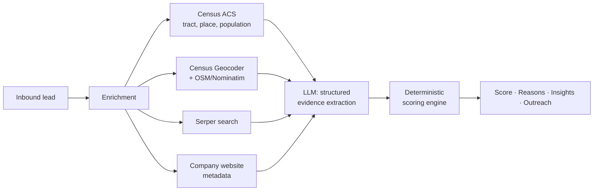

# Inbound SDR Copilot

**Lead enrichment and scoring for property-management sales teams.** Paste in an inbound lead — a name, a company, a property address — and get back an explainable 0-100 priority score, the evidence behind it, and a personalized outreach email.

Built with FastAPI + Next.js

---

## The problem

Inbound leads arrive as a name, an email, and an address. An SDR has to answer three questions before touching the phone:

- **Who should I prioritize?**
- **Why is this lead worth my time?**
- **What should I say?**

Answering those by hand means tab-hopping through Census data, company websites, and Google. This tool does it in one pass and shows its work.

## How it works

Every lead runs through the same pipeline:


```mermaid
flowchart LR
  lead["Inbound lead"] --> enrich["Enrichment"]
  enrich --> census["Census ACS<br/>tract, place, population"]
  enrich --> geo["Census Geocoder<br/>+ OSM/Nominatim"]
  enrich --> serper["Serper search"]
  enrich --> site["Company website<br/>metadata"]
  census & geo & serper & site --> llm["LLM: structured<br/>evidence extraction"]
  llm --> score["Deterministic<br/>scoring engine"]
  score --> out["Score · Reasons · Insights · Outreach"]
```

The design decision that matters: **the LLM never picks the score.** It reads source-backed evidence and sorts it into buckets ("leasing volume: High", citing this snippet). Python maps buckets to points. Every number traces to a rule and every rule traces to a citation — and when the model is unavailable, returns malformed JSON, or cites evidence that isn't in the sources, a deterministic rule classifier takes over and the system keeps working.

## Scoring

Final score is out of 100, split across three categories:

| Category | Points | What it estimates |
| --- | --- | --- |
| **Location Fit** | 45 | Leasing demand at neighborhood and city level |
| **Company Fit** | 39 | Leasing volume, operational complexity, product fit |
| **Property Fit** | 16 | Whether the submitted property is a residential leasing asset |

| Final score | Priority |
| --- | --- |
| 75-100 | High |
| 50-74 | Medium |
| 0-49 | Low |

A lead only reaches High with evidence on all three axes: company and property fit alone top out at 55, so a strong operator in a market with no data lands at Medium, not High.

**Location Fit (45)** is mostly address-level, not city-level: tract renter share (10), neighborhood income (8), vacancy as a leasing-pressure proxy (6), and ACS commute/vehicle-access variables as a free stand-in for walkability (9) — with city population, median gross rent and growth contributing the remaining 12.

**Company Fit (39)** scores three micro-signals extracted from website metadata and search snippets — leasing volume, operational complexity, and product fit. Guardrails keep it honest: weak product fit caps the category at 15, no product fit caps it at 5, and unit counts are calibrated in code rather than trusted from the model.

**Property Fit (16)** decides whether the submitted address is actually a residential leasing asset, using OSM/Nominatim property type plus address-matched search evidence. Search snippets are filtered hard before classification — only exact-address, exact-street, or building-name matches survive, so "apartments near X" can't make an office tower look like a lease-up.

Two ideas run through all of it: **missing data lowers confidence, not the score**, and **irrelevant companies get capped regardless of how good their market looks**.

### Address resolution

Real inbound addresses include branded building names and odd local formats, so geography resolution is tracked separately from scoring: exact Census match → coordinate fallback via Nominatim → normalized variant → unresolved. Confidence is surfaced as metadata and never penalizes the score — it explains which geography the neighborhood data came from.

## Tech stack

| Layer | Choice |
| --- | --- |
| Backend | FastAPI, Pydantic, httpx, uv |
| Frontend | Next.js 16, React 19, Tailwind 4, shadcn/ui, zustand |
| Storage | Upstash Redis (shared run dashboard + quota counters) |
| Data | Census ACS, Census Geocoder, OSM/Nominatim, Serper |
| LLM | OpenAI, structured outputs only |
| Hosting | Vercel (both halves, free tier) |

## The demo

The hosted dashboard shows curated sample analyses bundled at build time, so it renders instantly with no cold start. Visitors can also run their own lead live — those results are stored and appear on everyone's dashboard tagged **Community**.

Live runs are capped (100/month globally, 3/day per visitor) to keep the public demo inside free API tiers. When the budget is spent the dashboard stays fully browsable; only new runs pause until the counter resets.

## Running locally

**Backend:**

```bash
cd backend
cp .env.example .env    # add CENSUS_API_KEY at minimum
uv sync
uv run dev              # http://localhost:8000
```

**Frontend:**

```bash
cd frontend
pnpm install
pnpm dev                # http://localhost:3000
```

Only `CENSUS_API_KEY` ([free signup](https://api.census.gov/data/key_signup.html)) is needed for meaningful Location Fit scores. `SERPER_API_KEY` and `OPENAI_API_KEY` unlock live company evidence and LLM-written outreach; without them the system falls back to rule-based classification and template outreach. Upstash credentials are optional locally — without them, run storage and quotas are no-ops.

**Tests and tooling:**

```bash
uv run pytest -q                                  # 94 tests
uv run python scripts/export_sample_analyses.py   # regenerate bundled demo data
uv run python scripts/seed_sample_runs.py         # push samples to the shared dashboard
uv run python scripts/verify_company_fit.py --live --company "Greystar"
```

## Deploying

One Vercel project runs both apps as services (see `vercel.json`): the Next.js
frontend at the root and the FastAPI backend behind `/api/backend` on the same
domain, so browser calls are same-origin and need no CORS.

Environment variables on that project:

| Variable | Value |
| --- | --- |
| `API_ROOT_PATH` | `/api/backend` — the prefix the API is mounted under |
| `NEXT_PUBLIC_API_BASE_URL` | `/api/backend` — relative, so it follows the domain |
| `CENSUS_API_KEY` | Required for meaningful Location Fit scores |
| `SERPER_API_KEY`, `OPENAI_API_KEY` | Optional; without them the rule-based fallbacks run |
| `UPSTASH_REDIS_REST_URL`, `UPSTASH_REDIS_REST_TOKEN` | Shared dashboard and quotas |
| `MAX_RUNS_PER_MONTH`, `MAX_RUNS_PER_IP_PER_DAY` | Spend caps; `100` / `3` in production |

Then run `seed_sample_runs.py` once to populate the shared dashboard.

To deploy the two apps as separate projects instead, set each project's root
directory to `backend/` or `frontend/`, leave `API_ROOT_PATH` empty, and point
`NEXT_PUBLIC_API_BASE_URL` at the backend's absolute URL plus `FRONTEND_ORIGIN`
at the frontend's.

## Limitations

- Free public APIs have rate limits and incomplete coverage, especially for small property managers.
- City and tract data are proxies for property-level opportunity, not proof of account quality.
- Search engines return neighborhood and nearby-building noise; the address filter is strict but not perfect.
- U.S. data sources only — international leads fall back to company-level signals.

## Background

Originally built as a GTM-engineering take-home: automate the inbound lead process with public APIs, produce enriched and scored leads, and describe how the tool would be rolled out to a sales org. It's been reworked since into a hostable demo — precomputed sample data, a shared dashboard, and run quotas — but the scoring engine is the original work.

<details>
<summary>Rollout plan from the original submission</summary>

**Phase 1 — MVP validation (week 1).** Test 20-50 sample leads with 2-3 SDRs and a sales manager; compare model scores against SDR intuition.

**Phase 2 — Pilot (weeks 2-3).** Run daily batches on real inbound leads; SDRs review scores before outreach and use generated emails as a starting point. Track time saved per lead and conversion vs. baseline.

**Phase 3 — Iteration (weeks 3-4).** Refine scoring weights, property classification, and outreach tone against SDR feedback and mis-ranked leads.

**Phase 4 — Org rollout (week 4+).** Integrate into the CRM, auto-trigger enrichment on new inbound leads, and close the feedback loop.

</details>
